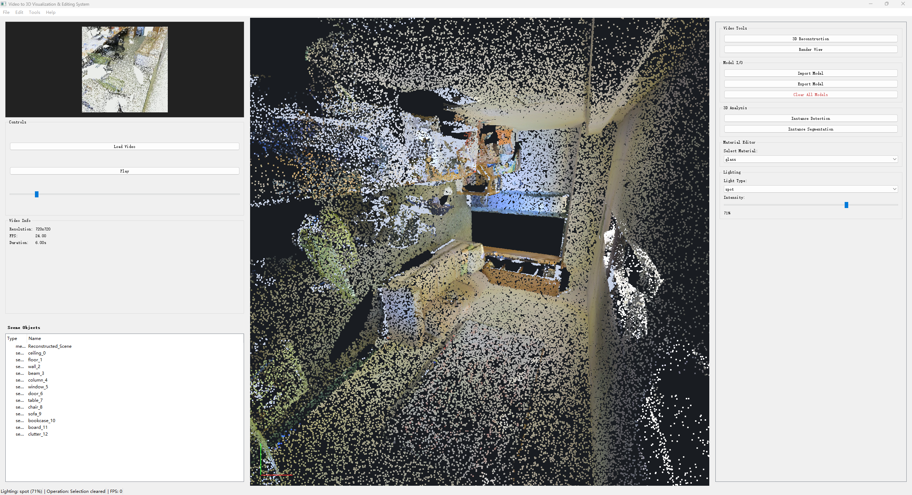

# 视频驱动三维可视化与智能编辑系统

## GUI 界面预览



## 项目概述

本项目是计算机视觉课程综合实践系统，目标是完成从视频输入、三维重建、模型导入导出、实例检测/分割、材质替换到光照调节的端到端流程。当前稳定版本不再使用普通单目视频直接重建，而是基于 S3DIS 室内点云数据生成带有 color/depth/pose 的 RGB-D 推进视频，再使用 Open3D Scalable TSDF Fusion 生成室内场景三角网格。

这种流程更适合课程演示：视频可以正常加载和播放，重建结果可复现，实例列表来自 S3DIS 语义标注，材质和光照编辑可直接作用于重建后的整体模型或分割实例。

## 当前功能

- 视频导入与播放：支持 MP4、AVI、MOV、MKV。
- S3DIS 数据预处理：从 `Stanford3dDataset_v1.2_Aligned_Version` 原始目录生成项目使用的 `.npy` 文件。
- RGB-D 视频生成：从 S3DIS 房间点云生成平滑推进 MP4，同时保存 color、depth、pose 和相机内参。
- 三维重建：使用 Open3D TSDF 融合 RGB-D 序列，输出 PLY 三角网格。
- 实例检测/分割：优先读取生成脚本输出的 S3DIS 实例 summary；未找到 summary 时才回退到模型推理。
- 材质替换：支持 metal、wood、plastic、glass、stone、ceramic、fabric 七类演示材质。
- 光照调节：支持 ambient、directional、point、spot 四种显示模式。
- 模型导入导出：支持 OBJ、PLY、STL、GLB、GLTF；点云导出 OBJ 时会自动网格化。

## 数据集

本项目使用 Stanford Large-Scale 3D Indoor Spaces Dataset（S3DIS）。

- 下载地址：[https://cvg-data.inf.ethz.ch/s3dis/](https://cvg-data.inf.ethz.ch/s3dis/)
- 本地说明文件：`data/datasets/S3DIS/ReadMe.txt`
- 原始目录：

```text
data/datasets/S3DIS/Stanford3dDataset_v1.2_Aligned_Version/
```

S3DIS 包含 6 个 Area，场景主要来自教学楼和办公建筑，包括办公室、会议室、礼堂、走廊、大厅、楼梯等。原始点云每行有 6 列，格式为 `X Y Z R G B`。语义标注包含 12 类建筑/家具元素以及 clutter 类，共 13 类：

```text
ceiling, floor, wall, beam, column, window, door,
table, chair, sofa, bookcase, board, clutter
```

## 数据预处理

将 S3DIS 原始 `Annotations/*.txt` 转换为项目统一 `.npy` 格式：

```cmd
python data\preprocess_scannet.py --raw data\datasets\S3DIS\Stanford3dDataset_v1.2_Aligned_Version --output data\datasets\S3DIS\processed
```

输出结构：

```text
data/datasets/S3DIS/processed/
  train/*.npy
  val/*.npy
  test/*.npy
```

每个 `.npy` 保存：

- `points`: `N x 6`，XYZ + RGB
- `labels`: `N`，S3DIS 13 类语义标签
- `area`、`room`、`source`、`label_counts`

## 生成演示视频与重建

推荐直接使用自动场景选择：

```cmd
python tools\generate_s3dis_scene_video.py --scene auto --reconstruct
```

该脚本会生成：

```text
data/input_videos/s3dis_*.mp4
data/input_videos/s3dis_*_rgbd/color/*.png
data/input_videos/s3dis_*_rgbd/depth/*.png
data/input_videos/s3dis_*_rgbd/pose/*.txt
data/input_videos/s3dis_*_rgbd/meta.json
data/output_models/s3dis_*_tsdf_mesh.ply
data/output_models/s3dis_*_segmented_labels.ply
data/output_models/s3dis_*_instances/*.ply
data/output_models/s3dis_*_summary.json
```

当前相机路径为 coverage 模式，会从多个横向位置和反向视角覆盖房间，避免只重建半个房间。

## 运行 GUI

```cmd
python main.py
```

推荐操作流程：

1. 点击 `Open Video`，选择 `data/input_videos/s3dis_*.mp4`。
2. 点击 `3D Reconstruction`，系统自动查找同名 `_rgbd` 工程并生成整体 mesh。
3. 点击 `Instance Detection` 或 `Instance Segmentation`，加载 S3DIS 实例列表。
4. 在 `Scene Objects` 中选择某个实例，高亮显示对应区域。
5. 在 `Material Editor` 中切换材质，观察实例颜色变化。
6. 使用 `Lighting` 调节显示效果。
7. 点击 `Export Model` 导出当前结果。

## 配置文件

主要参数集中在 `config.py`。

常用参数：

```python
POINT_SIZE = 4.0
SIMPLE_POINT_SIZE = 4.5
TSDF_VOXEL_LENGTH = 0.025
TSDF_SDF_TRUNC = 0.10
GENERATED_SCENE_MAX_POINTS = 300000
GENERATED_VIDEO_FRAMES = 144
GENERATED_VIDEO_SIZE = 720
GENERATED_CAMERA_PATH_MODE = "coverage"
ANALYSIS_SAMPLE_POINTS = 50000
```

调参建议：

- 重建太稀疏：减小 `TSDF_VOXEL_LENGTH`，例如 `0.02`。
- 生成视频点云细节不足：增大 `GENERATED_SCENE_MAX_POINTS`。
- 视口点云太细：增大 `POINT_SIZE` 和 `SIMPLE_POINT_SIZE`。
- 想更快测试：减小 `GENERATED_VIDEO_FRAMES` 和 `GENERATED_VIDEO_SIZE`。

## 训练分割模型

课程要求中自主训练部分保留在三维语义分割模块。预处理完成后可运行：

```cmd
python train.py
```

训练脚本默认读取：

```text
data/datasets/S3DIS/processed/train
```

模型检查点保存到：

```text
data/checkpoints/segmentation_model_final.pth
```

## 项目结构

```text
main.py                         GUI 入口
config.py                       全局配置
core/
  rgbd_tsdf_reconstructor.py     RGB-D TSDF 三维重建
  model_io.py                    模型导入导出
  instance_detector.py           实例检测
  instance_segmentor.py          实例分割
  material_editor.py             材质编辑
  lighting_system.py             光照参数
  video_processor.py             视频读取
gui/
  main_window.py                 主窗口逻辑
  viewport_3d.py                 OpenGL 三维视口
  control_panel.py               控制面板与 Scene Objects
  video_panel.py                 视频面板
tools/
  generate_s3dis_scene_video.py  S3DIS 视频、RGB-D 和重建生成
data/
  preprocess_scannet.py          S3DIS 原始数据预处理
  datasets/S3DIS/                S3DIS 数据集
  input_videos/                  生成视频和 RGB-D 工程
  output_models/                 重建、分割和导出模型
training/
  train_segmentation.py          分割训练流程
  dataset_loader.py              S3DIS 数据加载
models/
  segmentation_model.py          分割网络
```

## 常见问题

### 重建只有半个房间

请重新运行最新版生成脚本：

```cmd
python tools\generate_s3dis_scene_video.py --scene auto --reconstruct
```

新版默认使用 `GENERATED_CAMERA_PATH_MODE = "coverage"`，会从多个侧向和反向视角采集 RGB-D 帧。

### 视口模型太稀疏或太小

编辑 `config.py`：

- 增大 `POINT_SIZE`
- 减小 `TSDF_VOXEL_LENGTH`
- 增大 `GENERATED_SCENE_MAX_POINTS`

### 导出 OBJ 很慢

如果当前模型是点云，导出 OBJ 会先自动网格化，速度比导出 PLY 慢。若只需要保留点云颜色，优先导出 PLY。

## 参考

- S3DIS Dataset: [https://cvg-data.inf.ethz.ch/s3dis/](https://cvg-data.inf.ethz.ch/s3dis/)
- S3DIS paper: Armeni et al., 3D Semantic Parsing of Large-Scale Indoor Spaces, CVPR 2016.
- Open3D: [https://www.open3d.org/](https://www.open3d.org/)
- PointNet++: [https://arxiv.org/abs/1706.02413](https://arxiv.org/abs/1706.02413)
